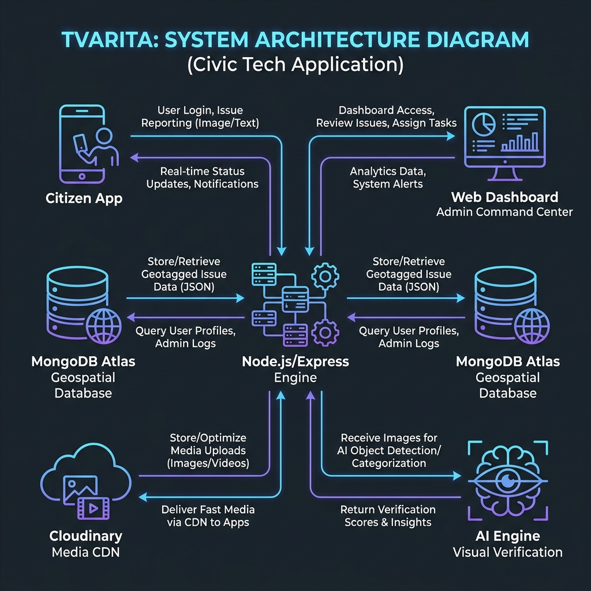

# ⚡ Tvarita: AI-Powered Civic Issue Reporting & Management Platform


## 🌟 Overview

**Tvarita** (Sanskrit for "Fast") is a state-of-the-art, end-to-end civic platform designed to optimize municipal maintenance and bridge the communication gap between citizens and authorities. By leveraging AI-powered visual verification and geospatial intelligence, Tvarita transforms how infrastructure failures like potholes, open manholes, and broken streetlights are reported, prioritized, and resolved.

### 🎯 The Motivation
Urban infrastructure degrades daily, directly impacting citizen safety. Tvarita was born from the need to create a transparent, instant, and intelligent reporting channel that empowers communities to maintain their cities through modern technology.

---

## 🚀 Key Features

### 🤖 AI Sentinel (Visual Verification)
To ensure data integrity, the system utilizes the **Salesforce BLIP Deep Learning model** (via Hugging Face API) to visually verify images. If a user tries to report a "Danger" with a photo of a pizza, the AI automatically detects the semantic mismatch and blocks the spam.

### 📍 Geospatial Intelligence
- **Location-Aware Reporting**: Every report is GPS-locked with photo evidence.
- **Duplicate Detection**: The backend calculates geospatial proximity (20m radius) to prevent redundant reports for the same issue.

### ⚖️ Life-Risk Priority Algorithm
Issues are not treated on a "first-come, first-served" basis. Our algorithm automatically escalates life-threatening issues (like open manholes or live electric wires) to **"Critical"** status, ensuring authorities fix the most dangerous problems first.

### 🛡️ Demo-Ready Security
- **Immutable Admin**: The master administrator account (`admin@tvarita.com`) is armor-plated at the database level to prevent accidental deletion or unauthorized modification during live demonstrations.
- **Automated Seeding**: The system automatically generates a standard set of demonstration users upon startup, ensuring the platform is always ready for a flawless walkthrough.

---

## 🏗️ System Architecture



1.  **Citizen App**: Captures Base64 images and GPS coordinates.
2.  **Central API**: Routes data and handles geospatial indexing.
3.  **Media Engine (Cloudinary)**: Securely stores and optimizes evidence imagery.
4.  **AI Vision (Hugging Face)**: Verifies civic relevance using the BLIP model.
5.  **Database (MongoDB Atlas)**: Stores verified metadata with 2dsphere indexing.
6.  **Authority Dashboard**: Provides real-time maps and priority queues for efficient resolution.

---

## 🛠️ Technology Stack

| Layer | Technologies |
| :--- | :--- |
| **Mobile App** | React Native, Expo, React Navigation, Expo-Location |
| **Web Dashboard** | React.js, Vite, TailwindCSS, Leaflet.js (Maps) |
| **Backend** | Node.js, Express.js, JWT (Auth), Bcrypt |
| **Database** | MongoDB Atlas (NoSQL), Cloudinary (Storage) |
| **AI/ML** | Hugging Face Inference API (Salesforce BLIP) |

---

## 💻 Setup & Installation

### Prerequisites
- Node.js (v16+)
- MongoDB Atlas Account
- Cloudinary Account
- Hugging Face API Key

### 1. Backend
```bash
cd backend
npm install
# Create a .env file with:
# MONGODB_URI, JWT_SECRET, CLOUDINARY_CLOUD_NAME, CLOUDINARY_API_KEY, CLOUDINARY_API_SECRET, HUGGING_FACE_API_KEY
npm start
```

### 2. Web Admin
```bash
cd web-admin
npm install
# Configure backend URL in config if necessary
npm run dev
```

### 3. Mobile App
```bash
cd mobile-app
npm install
npx expo start
```

---

## 🛤️ Future Roadmap
- **Predictive Maintenance**: Predict pothole formation using historical monsoon data.
- **Automated Dispatch**: Nearest verified contractor assignment based on GPS.
- **Direct Alerts**: Automated SMS/WhatsApp updates for resolution status.
- **Gamification**: "Civic Leaderboard" to reward active citizen reporters.

---

## 👤 Default Admin Access
- **Email**: `admin@tvarita.com`
- **Password**: `dhanesh`

---

*Built with ❤️ for a safer, smarter city.*
